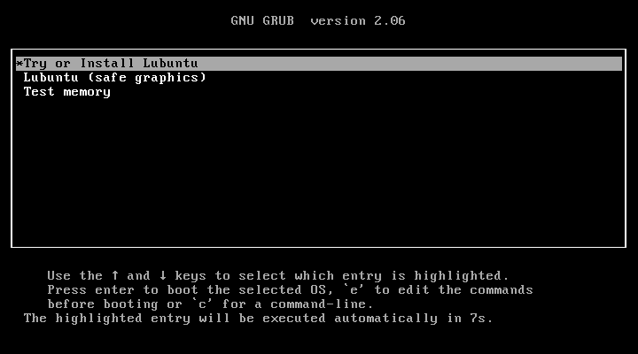
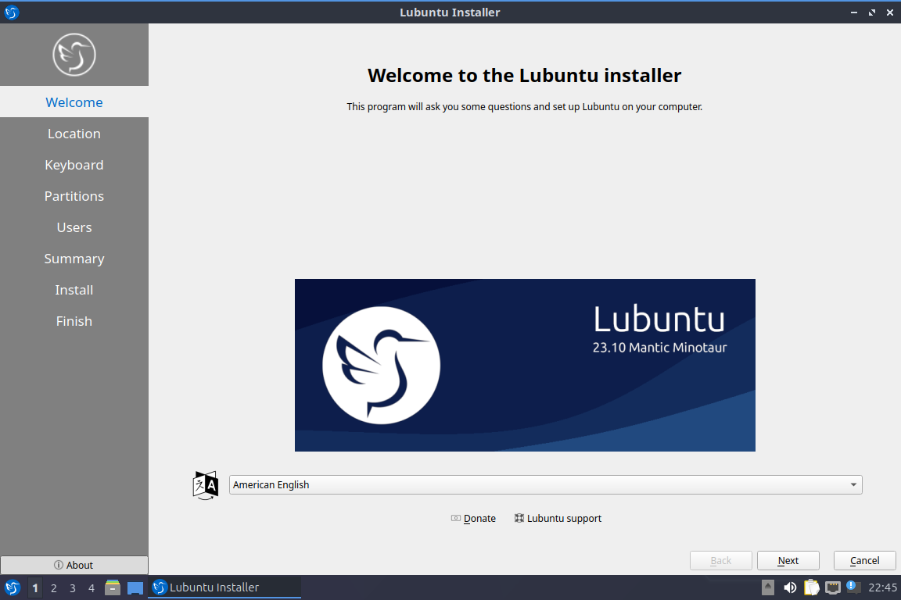

External resources:
- https://manual.lubuntu.me/stable/1/Installing_lubuntu.html

# Most important steps
In addition to the computer, you will need:
- A usb with the lubuntu boot image on it

Steps:

1. Plug the usb into the computer and turn it on
2. [Get the BIOS to boot onto the usb](#booting-into-the-install-environment)
3. Run the "Install Lubuntu xx.xx" icon on the desktop
4. [Go through the installer](#the-installer)

## Booting into the install environment
May be of use: [BIOS and booting](../explanation%20of%20stuff/BIOS%20and%20booting.md) and [boot terms](../explanation%20of%20stuff/boot%20terms.md)

When you start a computer, often there will be a boot screen with some text (near the bottom of the screen usually) like "press f12 for boot menu" or similar. What we want to do, is to get the computer to boot onto the boot image on the usb  instead of the operating system on the disk.

Ways to do this depend on the device, its BIOS version and previous configuration options. This document will detail a few ways that commonly work to change which device the BIOS boots into, ideally it would be updated over time as more exceptions are discovered.

### Selecting the usb as the boot device
When the BIOS screen appears, there should be some option like "select boot device" or similar, it may not have this name and if you are unable to find an option that appears similar to "select boot device", going through every option that appears when you turn the computer on and off may work.

After pressing the key asosciated with the option, a menu should show up listing every bootable device the BIOS has access to. Usually there are 2 or 3 devices already there, so you'll have to find the correct device by:
- choosing the device titled "USB drive", "Optical drive" or similar
- choosing the device that shows up only when the USB is plugged in, if you cannot tell by the name alone

After booting, the GRUB boot menu should appear, confirming that the USB is the device being booted off of (assuming that the disk's operating system is windows, or doesn't use grub, or doesn't get as far as grub)

 <!-- might want to add accessiblity attributes to image tags? -->

*This is an image of how the GRUB menu should look like*

### Changing the boot order
If there is no option to select the boot device, it may be possible to change the boot device order in the BIOS or UEFI settings.

After getting to the BIOS menu, select the option titled "boot options", "BIOS options", "UEFI options", or similar. This should lead you to a screen allowing you to change boot configuration options.

Some devices have fancy GUIs that are more similar to the GUI of a modern operating system, and others are more simple text-based UI's that have simple color-palletes and no mouse cursor.

Find a tab or category titled "boot options", "boot devices", "boot order" or similar, and look for an option that lists devices in the order the BIOS tries to boot them. After you find this, change the order so that the BIOS tries to boot the USB before the disk.

## The installer

1. Select the installation language (probably American english or British english)
2. Select the region and timezone (Auckland or NZST)
3. Select the keyboard layout (probably US default)
4. Set up partitions (defaults should be fine ***check this***) *swap may be necessary for some of the older machines with little RAM*
5. Set up users (*we need to figure out what we're gonna do here*)

    Options for user setup:
    - tick log in automatically and have students use the same account
    - have a default account and password and have students use the same account
    
        Ideally we'd have what windows does and have seperate accounts for each student that integrates with the school MS accounts
6. Press `Install` and then press `Install now`
7. Keep the `Reboot now` checkbox ticked, press `Done` and remove the USB after the computer has turned off
8. Ensure that Lubuntu is installed on the device by waiting for Lubuntu to start and check you can sign in.

# Things you probably won't have to do
## Creating a bootable USB
You will need:
- A tool to burn the image onto the USB (we will use Balena Etcher in these steps, but they should be similar for other etchers)
- A USB
- A disk image of the OS you want to install (Lubuntu images available [here](https://lubuntu.me/downloads/))

Steps:
1. Open the etcher application
2. Select the disk image you downloaded
3. Select the USB
4. Etch the USB
5. Remove the USB after the etching is finished (ideally wait for validation as well)